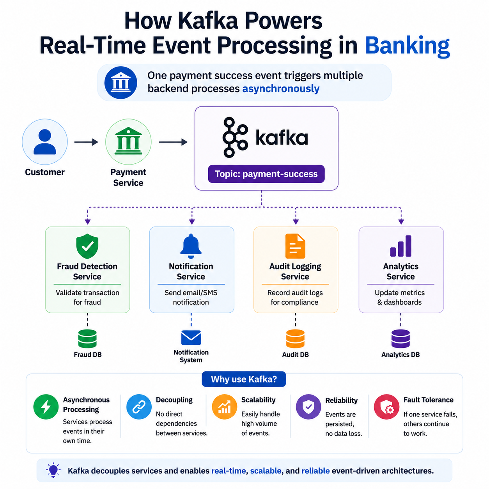
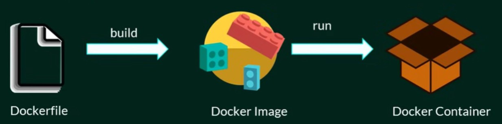
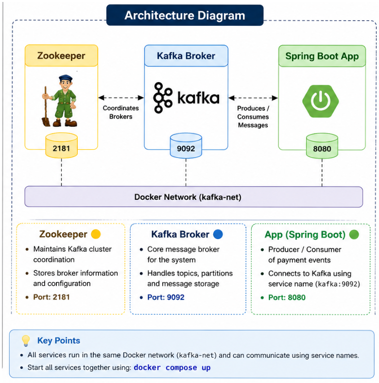

# Kafka Banking Event-Driven Demo

This project demonstrates an end-to-end event-driven payment system built using Spring Boot and Apache Kafka, fully containerized using Docker.

The application publishes payment events to a Kafka topic, and multiple backend services consume the same event independently for different processing tasks.

## Architecture Diagram


## Technologies Used
- Java 8
- Spring Boot
- Apache Kafka
- Zookeeper
- Docker & Docker Compose
- REST API
- Maven
- WSL2 + Ubuntu (Development Environment)

## Event Flow
Payment Service → Kafka Topic (payment-success)

Multiple consumers process the same event independently:
- Fraud Detection Service
- Notification Service
- Audit Service
- Analytics Service


## Why Kafka?
Kafka enables asynchronous communication between services and helps improve:
- Scalability
- Decoupling
- Reliability
- Fault tolerance
- Real-time event processing

## Why Docker?
This ensures: “It works the same on every machine.”
For Ex: Suppose your Spring Boot app works on your laptop but fails on another
system because:
Java version is different
Maven version is different
Some dependency is missing
Docker solves this by packaging everything together inside a container





## Docker Setup
1️⃣ Dockerfile (Spring Boot App)
- Created Dockerfile for containerizing Spring Boot application
- Built JAR using Maven
- Used OpenJDK base image

2️⃣ Docker Compose Setup
- Configured multi-container setup:
- Kafka
- Zookeeper
- Spring Boot App

- One command setup for full system: docker-compose up


## Development Setup
- Environment Setup:
- Installed WSL2 on Windows
- Configured Ubuntu Linux environment
- Installed Docker Desktop
- Verified Docker CLI integration


## API Testing
- Used Postman to test REST APIs
- Payment request triggers Kafka event
- Verified event publishing in Kafka topic


## Key Features
- Payment processing API
- Kafka event publishing
- Asynchronous communication
- Fully containerized system
- Multi-service orchestration using Docker Compose


## Issues Faced & Fixes
- Docker Image Pull Issue
- Error:
- failed to fetch oauth token
- lookup auth.docker.io: no such host
- Root Cause:
- Network/DNS issue
- Docker Hub connectivity failure
- Fix:
- Restarted Docker Desktop
- Fixed internet/DNS resolution
- Successfully pulled base images


## Final Outcome
- Kafka running successfully
- Zookeeper running
- Spring Boot app containerized
- Docker Compose working
- End-to-end payment flow implemented
- Event-driven architecture achieved


## API Endpoint
POST /payments/process


### Request Body
```json
{
  "transactionId": "TXN101",
  "customerName": "Punam",
  "amount": 5000
}
```


## Run Steps
1. Clone the Repository
   git clone <repo-url>
   cd <project-folder>
2. Build & Start All Services (Docker Compose)
   docker-compose up --build
3. This will start:
   Zookeeper
   Kafka
   Spring Boot Application
4. Verify Running Containers - docker ps
5. Trigger API using Postman - Send request to: POST /payments/process
6. Payment processed and event published to kafka.


